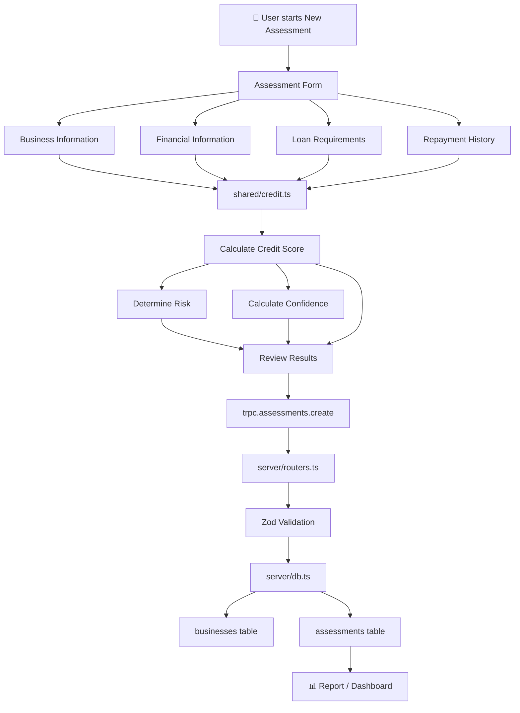
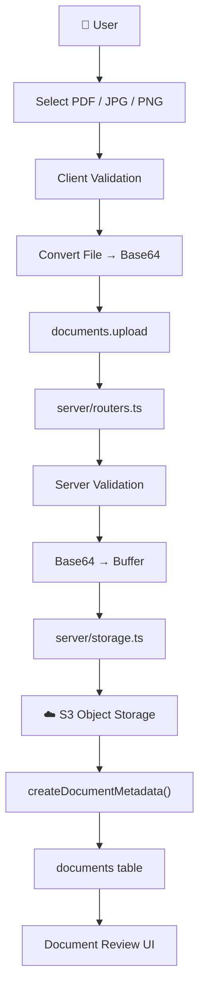
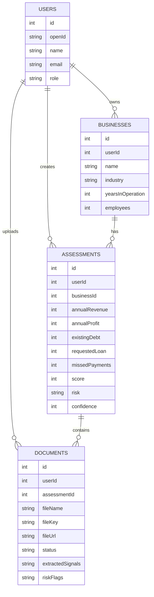
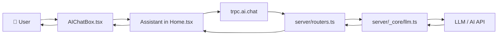
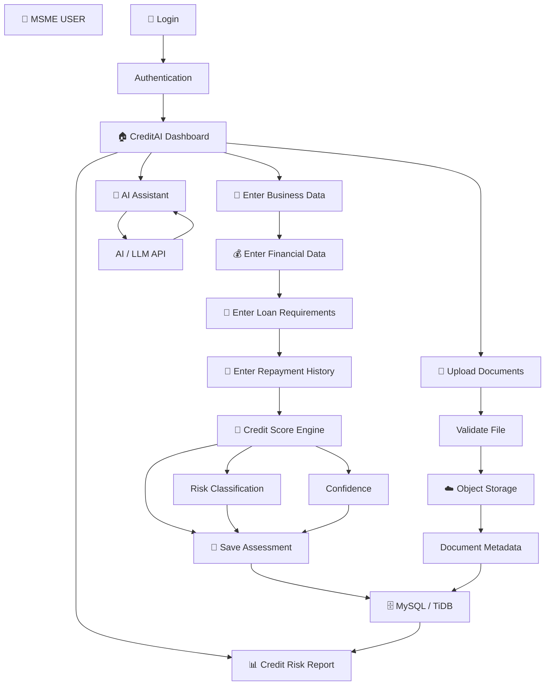

# CreditAI MSME — Complete Project Workflow & Architecture

## 1. Overview

CreditAI is an AI-powered MSME Credit Risk Assessment system.

The application is organized into several layers:

```text
React Frontend
      ↓
tRPC API
      ↓
Server Business Logic
      ↓
Database / Object Storage / AI Services
```

Not every file connects directly to every other file. The project follows a layered architecture where each folder has a specific responsibility.

---

# 2. Overall Architecture


---

# 3. Application Startup Workflow

The application starts through the following chain:

```text
Browser
   ↓
client/index.html
   ↓
client/src/main.tsx
   ↓
client/src/App.tsx
   ↓
client/src/pages/Home.tsx
```

## `client/src/main.tsx`

This is the React entry point. It mounts the application into the browser.

```text
main.tsx
   │
   └── App.tsx
```

## `client/src/App.tsx`

This sets up the major application providers and the main application page.

```text
App.tsx
 ├── ThemeProvider
 ├── TooltipProvider
 ├── ErrorBoundary
 └── Home
```

---

# 4. Home.tsx — Main Frontend Controller

`client/src/pages/Home.tsx` is one of the most important frontend files.

It controls the main CreditAI workspace.

```text
Landing Page
     ↓
Login
     ↓
Application Workspace
     ↓
 ┌──────────┬────────────┬───────────┬───────────┐
 │ Overview │ Assessment │ Documents │ Report    │
 └──────────┴────────────┴───────────┴───────────┘
                              +
                         AI Assistant
```

The application uses route-based navigation.

Typical application routes are:

```text
/
 └── Landing

/login
 └── Login

/app/overview
 └── Overview

/app/assessment
 └── Assessment

/app/documents
 └── Documents

/app/report
 └── Report

/app/assistant
 └── AI Assistant
```

---

# 5. Authentication Workflow

Authentication connects the frontend login system to the backend session and database.

```mermaid
flowchart LR
    USER["User"] --> LOGIN["Login Screen"]
    LOGIN --> OAUTH["OAuth"]
    OAUTH --> COOKIE["Session Cookie / Bearer Token"]
    COOKIE --> CONTEXT["server/_core/context.ts"]
    CONTEXT --> SDK["server/_core/sdk.ts"]
    SDK --> VERIFY["Verify Session"]
    VERIFY --> DB["server/db.ts"]
    DB --> USERS["users table"]
    USERS --> USERCTX["Authenticated User"]
    USERCTX --> PROTECTED["protectedProcedure"]
```



Important files:

```text
client/src/_core/hooks/useAuth.ts
             ↓
server/_core/context.ts
             ↓
server/_core/sdk.ts
             ↓
server/_core/oauth.ts
             ↓
server/db.ts
             ↓
drizzle/schema.ts
```

The `users` table stores information such as:

- User ID
- OpenID / authentication identifier
- Name
- Email
- Login method
- Role
- Timestamps

---

# 6. Core Credit Assessment Workflow

The credit assessment is the central business function of the project.



---

# 7. Credit Score Calculation

The main credit calculation logic is contained in:

```text
shared/credit.ts
```

The input structure contains information such as:

```text
CreditInputs
 ├── annualRevenue
 ├── annualProfit
 ├── existingDebt
 ├── requestedLoan
 ├── yearsInOperation
 ├── revenueGrowth
 └── missedPayments
```

The calculation flow is:

```text
Inputs
   ↓
Profit Margin
   ↓
Debt Load
   ↓
Base Score
   ↓
Revenue Growth adjustment
   ↓
Business maturity adjustment
   ↓
Debt penalty
   ↓
Missed payment penalty
   ↓
Final Score
   ↓
Risk Category
   ↓
Confidence
```

Typical risk classification in the project:

```text
Score >= 740
     ↓
LOW RISK

600–739
     ↓
MODERATE RISK

< 600
     ↓
HIGH RISK
```

`shared/credit.ts` is important because it contains reusable business logic that can be shared by frontend and backend code.

---

# 8. Assessment Submission Workflow

When the user submits an assessment:

```text
Assessment Component
       ↓
calculateCreditScore()
       ↓
trpc.assessments.create
       ↓
server/routers.ts
       ↓
Zod validation
       ↓
createAssessment()
       ↓
server/db.ts
       ↓
Check existing business
       ↓
 ┌───────────────┐
 │ Existing?     │
 └───────┬───────┘
     YES │ NO
         ↓
 Update │ Create
 business
         ↓
       businesses
         ↓
       assessments
         ↓
     Assessment ID
```

The database relationship can be represented as:

```text
users
  │
  ├───────────────→ businesses
  │                      │
  │                      └── business profile
  │
  └───────────────→ assessments
                         │
                         └── financial assessment
```

---

# 9. Document Upload Workflow

Document upload is another major feature.



The document architecture supports:

```text
Allowed:
    PDF
    JPG
    PNG

Maximum:
    15 MB
```

Validation happens at multiple levels:

```text
Browser validation
       ↓
Server validation
       ↓
Storage
```

Client-side validation improves user experience, while server-side validation is the actual security boundary.

---

# 10. Document Storage Architecture

The uploaded document itself is not stored as a large binary object inside the relational database.

Instead:

```text
User File
    │
    ↓
server/storage.ts
    │
    ↓
S3 / Managed Object Storage
    │
    └── Actual file bytes


MySQL / TiDB
    │
    └── documents
          ├── fileName
          ├── fileKey
          ├── fileUrl
          ├── mimeType
          ├── fileSize
          ├── status
          ├── extractedSignals
          └── riskFlags
```

This separates:

- File storage → Object Storage
- File metadata → Database

This is a scalable design for document-heavy applications.

---

# 11. Document Analysis — Current vs Future Architecture

The UI is designed around document analysis, but the current ZIP primarily implements document upload, validation, storage, metadata, and review.

## Current workflow

```text
Upload document
      ↓
Validate
      ↓
Upload to storage
      ↓
Save metadata
      ↓
Show analysis/review UI
```

## Intended production workflow

```text
Upload
  ↓
Storage
  ↓
OCR / Document Extraction
  ↓
Extract financial values
  ↓
Risk flags
  ↓
User verification
  ↓
Assessment
```

OCR and advanced document extraction can therefore be added as a future extension.

---

# 12. Database Architecture

The database schema is defined through:

```text
drizzle/schema.ts
```

The major entities are:



---

# 13. Workspace Loading Workflow

When a user opens the dashboard:

```text
Home.tsx
    ↓
useAuth()
    ↓
Is user authenticated?
    ↓
YES
    ↓
trpc.workspace.get
    ↓
server/routers.ts
    ↓
getWorkspaceData()
    ↓
server/db.ts
    ↓
 ┌──────────────┬────────────────┬──────────────┐
 │ businesses   │ assessments    │ documents    │
 └──────────────┴────────────────┴──────────────┘
    ↓
workspace object
    ↓
Home.tsx
    ↓
Dashboard
```

Database queries should be filtered by the authenticated `userId` so that users only access their own records.

---

# 14. AI Assistant Workflow

The AI assistant is separate from the deterministic credit-score calculation.



Detailed flow:

```text
User question
      ↓
AIChatBox
      ↓
Assistant
      ↓
trpc.ai.chat
      ↓
server/routers.ts
      ↓
invokeLLM()
      ↓
LLM API
      ↓
AI response
      ↓
Chat UI
      ↓
User
```

`server/_core/llm.ts` is responsible for AI communication and related request handling such as:

- API requests
- Message normalization
- Tool configuration
- Response handling
- Retry logic
- Exponential backoff
- Error handling

---

# 15. Shared Folder Architecture

The `shared/` directory contains important reusable application logic.

```text
shared/
│
├── credit.ts
│     └── Credit score calculation
│
├── document.ts
│     └── Document validation
│
├── persistence.ts
│     └── Converts application data → DB records
│
├── types.ts
│     └── Shared TypeScript types
│
└── _core/
      └── errors.ts
```

Conceptually:

```text
          FRONTEND
             │
             ↓
        Shared Logic
             │
             ↓
          BACKEND
```

This avoids duplicating important validation and business rules.

---

# 16. Complete End-to-End Workflow

This is the main workflow of the entire CreditAI system:



---

# 17. File-to-File Connection Map

The most useful simplified connection map is:

```text
CLIENT
│
├── main.tsx
│      ↓
├── App.tsx
│      ↓
├── pages/Home.tsx
│      │
│      ├── useAuth.ts
│      │
│      ├── lib/trpc.ts
│      │       ↓
│      │   server/routers.ts
│      │
│      ├── shared/credit.ts
│      │
│      ├── AIChatBox.tsx
│      │
│      └── UI components
│
└─────────────────────────────────────
                    ↓
                  tRPC
                    ↓
SERVER
│
├── _core/context.ts
│       ↓
├── _core/sdk.ts
│       ↓
├── _core/oauth.ts
│
├── routers.ts
│      │
│      ├── db.ts
│      │      ↓
│      │   Drizzle ORM
│      │      ↓
│      │   MySQL/TiDB
│      │
│      ├── storage.ts
│      │      ↓
│      │   S3 Storage
│      │
│      ├── _core/llm.ts
│      │      ↓
│      │   LLM API
│      │
│      └── shared/
│             ├── credit.ts
│             ├── document.ts
│             └── persistence.ts
│
└─────────────────────────────────────
                    ↓
DATABASE
│
├── users
├── businesses
├── assessments
└── documents
```

---

# 18. Major Folder/File Responsibilities

| Folder/File | Main Responsibility |
|---|---|
| `client/src/` | Frontend React application |
| `client/src/pages/Home.tsx` | Main CreditAI UI/workspace |
| `client/src/components/` | Reusable UI components |
| `client/src/lib/trpc.ts` | Frontend → backend communication |
| `server/routers.ts` | API procedures/endpoints |
| `server/db.ts` | Database operations |
| `server/storage.ts` | File/object storage |
| `server/_core/context.ts` | Authenticated request context |
| `server/_core/sdk.ts` | Authentication/session handling |
| `server/_core/llm.ts` | AI/LLM communication |
| `shared/credit.ts` | Credit-score engine |
| `shared/document.ts` | File validation |
| `shared/persistence.ts` | Data transformation for DB |
| `drizzle/schema.ts` | Database structure |
| `drizzle/*.sql` | Database migrations |
| `scripts/` | Automated/browser testing |
| `package.json` | Dependencies and project commands |
| `vite.config.ts` | Frontend build configuration |
| `tsconfig.json` | TypeScript configuration |

---

# 19. Simplest Architecture to Remember

The entire system can be remembered as:

```text
React UI
   ↓
tRPC
   ↓
Server Router
   ↓
Business Logic
   ↓
 ┌───────────────┬────────────────┬──────────────┐
 ↓               ↓                ↓
Database       S3 Storage       AI/LLM
 ↓               ↓                ↓
Business       Documents        Assistant
Assessment
 ↓
Credit Risk Report
```

---

# 20. One-Line Project Workflow

```text
MSME User → Login → Enter Business & Financial Data → Credit Score Calculation → Risk Classification → Save Assessment → Upload Documents → Store Documents → Generate/View Report → Use AI Assistant
```

---

# 21. Presentation-Friendly Workflow

For a project presentation or viva, explain it in this order:

1. **User logs in**
2. **Frontend loads the CreditAI dashboard**
3. **User enters business and financial information**
4. **Frontend sends the request through tRPC**
5. **Server validates the request**
6. **Credit engine calculates the score**
7. **System determines risk category and confidence**
8. **Assessment is stored in the database**
9. **User can upload supporting documents**
10. **Documents are validated and stored in object storage**
11. **Document metadata is stored in the database**
12. **Dashboard retrieves the user's workspace data**
13. **Credit risk report displays the assessment**
14. **AI Assistant communicates with the LLM service for user questions**

The complete high-level flow is:

```text
                ┌────────────────────┐
                │    MSME USER       │
                └─────────┬──────────┘
                          ↓
                ┌────────────────────┐
                │   REACT FRONTEND   │
                └─────────┬──────────┘
                          ↓
                ┌────────────────────┐
                │    tRPC API        │
                └─────────┬──────────┘
                          ↓
                ┌────────────────────┐
                │  SERVER / ROUTER   │
                └──────┬─────┬───────┘
                       │     │
             ┌─────────┘     └──────────┐
             ↓                          ↓
   ┌──────────────────┐       ┌──────────────────┐
   │ CREDIT ENGINE     │       │ DOCUMENT STORAGE │
   │ shared/credit.ts  │       │ server/storage   │
   └─────────┬────────┘       └────────┬─────────┘
             ↓                         ↓
   ┌──────────────────┐       ┌──────────────────┐
   │ RISK SCORE       │       │ S3 / OBJECT      │
   │ + RISK CATEGORY  │       │ STORAGE          │
   └─────────┬────────┘       └──────────────────┘
             ↓
   ┌────────────────────────────────────┐
   │        MYSQL / TIDB DATABASE       │
   │ users / businesses / assessments   │
   │ documents                          │
   └────────────────┬───────────────────┘
                    ↓
          ┌──────────────────┐
          │  CREDIT REPORT   │
          └──────────────────┘

                    +
                    ↓
          ┌──────────────────┐
          │   AI ASSISTANT   │
          └────────┬─────────┘
                   ↓
             ┌────────────┐
             │ LLM / AI   │
             │ SERVICE    │
             └────────────┘
```

This document describes the architecture, data flow, file relationships, database relationships, document workflow, credit-score workflow, authentication flow, and AI-assistant workflow of the CreditAI MSME project.
